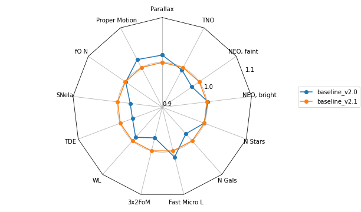

# Comparing v2.0 and v2.1 baseline simulations

## Changes

There are some subtle changes in the footprint. We have added the Virgo cluster, and simplified some regions so that each healpixel now has only 1 label (e.g., no more little NES swath near the galactic center).

We have also added a basis function to drive the collection of "good seeing" images in gri filters. 

## Science Impact

The science impact of the above changes are minimal, with our primary science metrics showing changes of 1-2%. 

